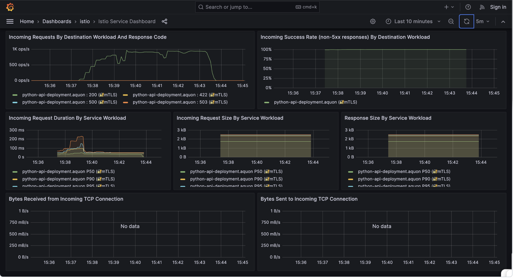
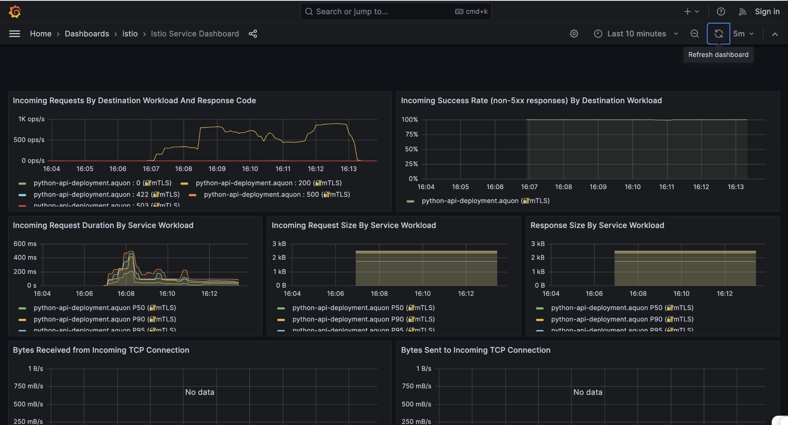
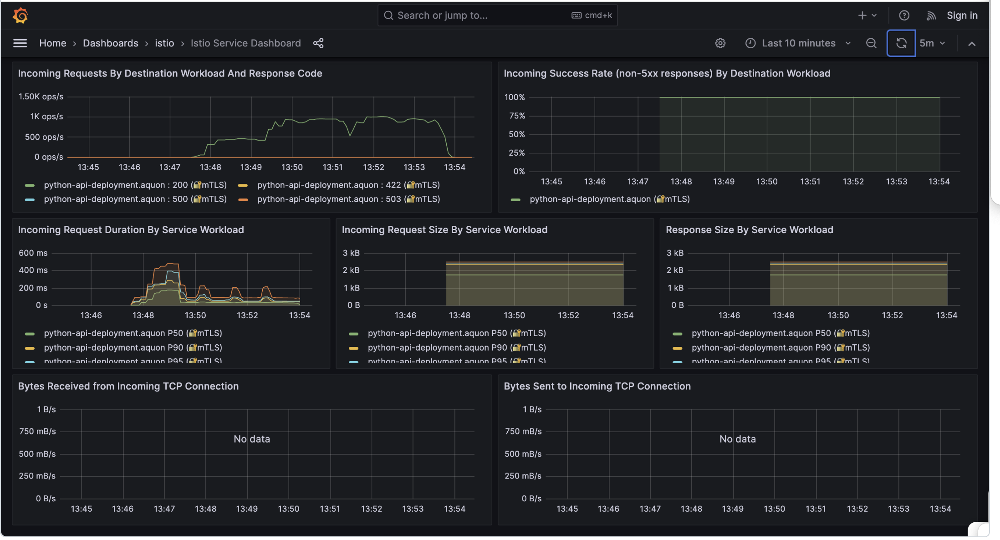
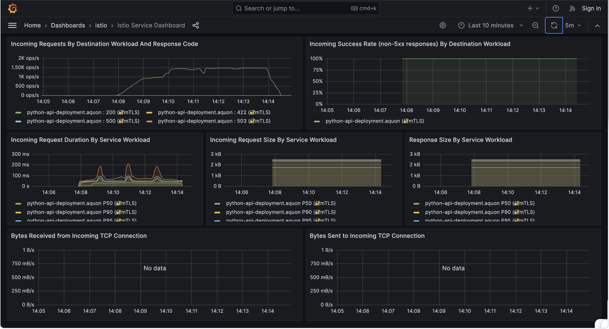
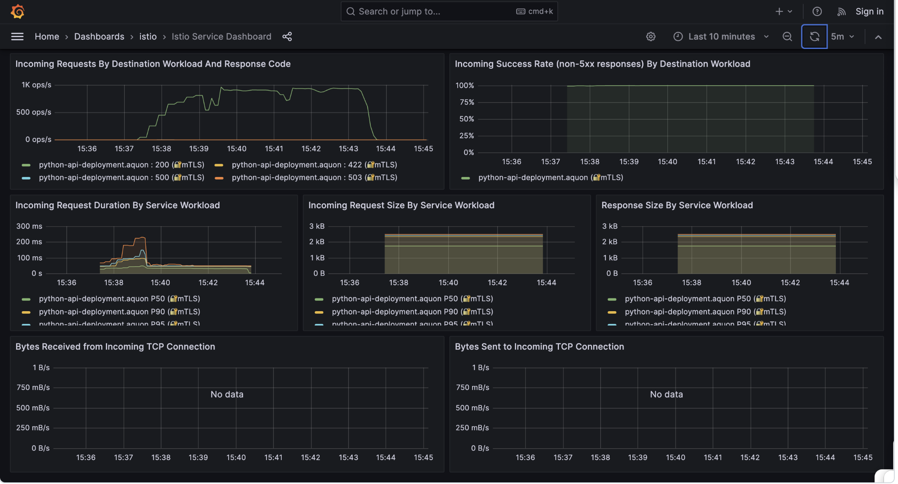

# Lab 5 Findings - [Anson Quon]

- [Lab 5 Findings - [Anson Quon]](#lab-5-findings---your-name)
  - [Introduction](#introduction)
  - [Findings](#findings)
    - [Finding 1](#finding-1)
    - [Finding 2](#finding-2)
    - [Finding 3](#finding-3)
    - [Finding 4](#finding-4)
    - [Finding 5](#finding-5)
  - [Conclusion](#conclusion)

---

## Introduction

In this lab, the objective is to learn how to use K6 in conjunction with Grafana to assess the performance of an ML prediction application deployed on AKS. Specifically, we will compare the performances of the cloud hosted application when different cache rates between 0 and 1 inclusive are used. 

A primary metric of application performance is latency, or the time it takes for processes to complete. These processes can include the time the server spends processing a request, making assessments of durations for endpoint testing a viable method for measuring the performance of our application. For our assessments, we will be testing the duration (in milliseconds) of the bulk-predict endpoint, which returns predictions given a list of inputs. Since the times our service takes between the moment a request arrives and when a response is generated vary for each individual, we will be reading p50, p90, and p99 values that take different response times into account. p50 refers to the median value of our response times, indicating that 50% of the users experience faster response times and the remaining users experience slower response times. Likewise, p90 refers to the point where 90% of users experience faster response times and the remaining 10% of users experience slower response times. Hence, lower p50, p90, and p99 values point to lower latency.

## Findings

The cache rates we will use are 0, 0.2, 0.5, 0.7, 0.9, and 1. Running load.js with "k6 run load.js" runs a script that sends a payload to our bulk-predict endpoint using a set cache rate. The findings below include snapshots of the service workloads for each cache rate.

### Finding 1

The above image shows the p50, p90, and p99 values for our prediction service when we use a cache rate of 0. In other words, no caching is done. Our p50 metric peaks at around 250 ms within the first minute before leveling down below 125 ms for the remaining period load.js is running. Similarly, the p90, p95, and p99 metrics peak at around 500 ms, 500 ms, and 750 ms respectively within the first minute before leveling down below 200 ms. Although all of the metrics remain below 200 ms until the end of the performance test, there are still peaks roughly a minute apart. We can attribute the large peak in the first minute of the test to the scaling up of users specified in load.js. When we scale to 100 users, we increase the load on our prediction service, making the duration of the requests temporarily longer than desired. Due to the horizontal scaler added to our service in lab 4, our service is able to deploy more pods and thus drive down the duration across all p50, p90, p95, and p99 metrics. The later peaks are primarily the p99 values, meaning that only 1% of requests are taking at least that long. These peaks are likely due to overload that can occur on our service when we sustain a large number of users for an extended period.

### Finding 2

The above image shows the p50, p90, and p99 values for our prediction service when we use a cache rate of 0.2. In other words, we have minimal caching. As with the case for no caching, we have a large peak within the first minute of the performance test. Our p50 metric peaks at around 200 ms within the first minute before leveling down below 125 ms for the remaining period load.js is running. Similarly, the p90, p95, and p99 metrics peak at around 400 ms, 450 ms, and 500 ms respectively within the first minute before leveling down below 250 ms. These peak values are due to the ramp up to 100 users within the first minute of running load.js. Although all of the metrics remain below 250 ms until the end of the performance test, there are two smaller peaks remaining, likely due to compute overload when we sustain a large number of users for an extended period. Unlike the case with no caching, the large initial peak is smaller when we use a 0.2 caching rate. This is expected since including minimal caching helps reduce runtime for repeated requests.

### Finding 3

The above image shows the p50, p90, and p99 values for our prediction service when we use a cache rate of 0.5. In other words, we have partial caching. As with the case for no caching and minimal caching, we have a large peak within the first minute of the performance test. Our p50 metric peaks to just below 200 ms within the first minute before leveling down below 150 ms for the remaining period load.js is running. Similarly, the p90, p95, and p99 metrics peak at around 300 ms, 400 ms, and just below 500 ms respectively within the first minute before leveling down below 250 ms. These peak values are due to the ramp up to 100 users within the first minute of running load.js. Although all of the metrics remain below 250 ms until the end of the performance test, there are three smaller peaks remaining, likely due to compute overload when we sustain a large number of users for an extended period. As expected, the large initial peak is smaller than the one observed when no caching is done since more caching helps reduce the runtime of our system when there are repeated requests. 

### Finding 4

The above image shows the p50, p90, and p99 values for our prediction service when we use a cache rate of 0.9. In other words, we have substantial caching. Unlike the observations for lower cache rates, we see evenly sized peaks at regular intervals rather than a very large initial peak followed by smaller peaks. Our p50 metric rises but stagnates at just around 50 ms throughout the duration of the performance test. However, the p90, p95, and p99 metrics exhibit peaks at around 75 ms, 100 ms, and around 200 ms respectively at regular intervals and remain below 100 ms otherwise. We can attribute the lack of a large initial peak to the substantial caching in place, which can help reduce the latency of our service even as the number of users increases. Despite an increase in the number of users, many of those requests may contain identical inputs.

### Finding 5

To further assess the consistency with decreased latency as we increase caching, we examine the latencies of our system when the cache rate is 1. From the above image, the large peak in durations within the first minute returns, albeit significantly smaller than the large initial peaks observed for lower cache rates. Moreover, there are no smaller peaks after the first minute, suggesting that there are many repeated requests that are handled by caching. Our p50 metric peaks to around 50 ms before plateauing to a slighly lesser duration. The p90 metric peaks to around 100 ms before dropping and hovering at around 50 ms. The p95 metric peaks at around 150 ms before dropping and hovering at around 50 ms. Finally, the p99 metric peaks at nearly 225 ms before dropping to around 50 ms. The large peak within the first minute likely reappears due to not only the ramp up in users but also requests that do not contain the same inputs. We recall that the payloads sent our bulk-predict endpoint have randomness associated with them. Hence, caching may not necessarily eliminate spikes in durations if there are no identical requests. Despite the initial spike in durations, the p50, p90, p95, and p99 metrics all remain below 100 ms. The relatively low metric values, even for p95 and p99, mean that no users experience longer durations than 100 ms after the initial ramp up and throughout the performance test.

## Conclusion

Based on our findings above, we conclude that more caching generally helps reduce the latency of our prediction service, especially when we scale up the number of users. However, the latencies may still increase during times when the compute is overloaded or when there are many requests with information not already in the cache.
